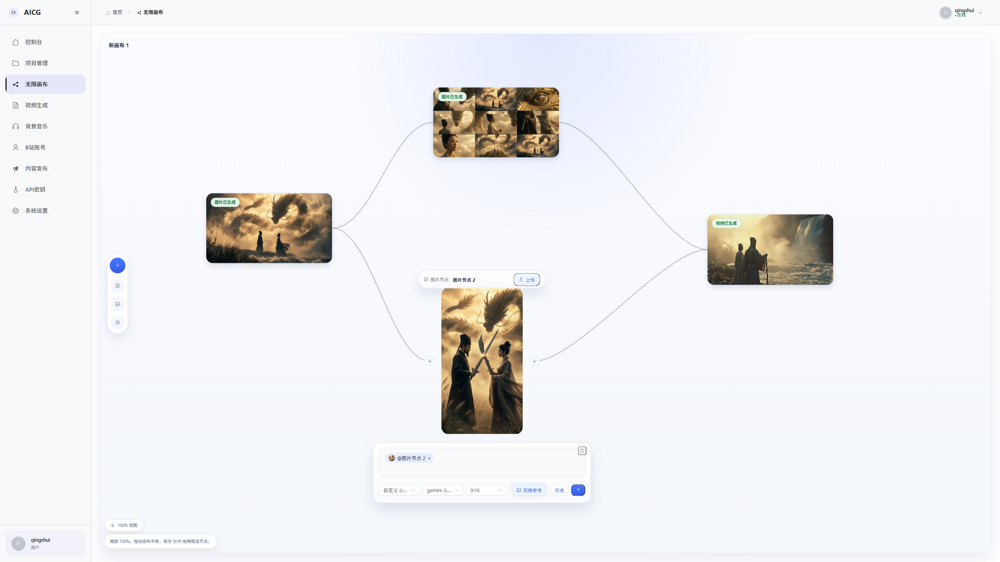

# AICON

[](LICENSE)
[](https://www.python.org/)
[](https://vuejs.org/)
[](https://fastapi.tiangolo.com/)
[](https://www.docker.com/)

AICON 是一套面向 AI 内容创作的全栈工作台，覆盖从文本理解、提示词组织、图片与视频生成，到素材管理和内容分发的完整流程，适用于 AI 电影、图文说、剧情短视频和可视化创作工作流等场景。

在线站点：[https://aicon-studio.com/](https://aicon-studio.com/)

技术栈：`FastAPI`、`Vue 3`、`PostgreSQL`、`Redis`、`Celery`、`MinIO`

> 说明：本人目前在广州地区求职中，具备丰富的 AI 应用开发经验，包括 Agent、RAG 等方向，欢迎相关技术岗位与合作机会交流。

## 目录

- [项目概览](#项目概览)
- [核心功能](#核心功能)
- [适用场景](#适用场景)
- [功能截图](#功能截图)
- [Star 趋势](#star-趋势)
- [演示](#演示)
- [快速开始](#快速开始)
- [使用说明](#使用说明)
- [更新日志](#更新日志)
- [交流与支持](#交流与支持)
- [仓库结构](#仓库结构)
- [相关文档](#相关文档)
- [License](#license)

## 项目概览

AICON 当前主要包含以下能力：

- `Movie Studio`：将长文本拆解为角色、场景、分镜、关键帧和过渡视频，形成完整的 AI 电影制作链路。
- `Picture Narration`：面向图文说和短视频配图场景，支持章节拆分、提示词生成、配图生成、语音合成与渲染。
- `Canvas`：将文本、图片、视频节点放在同一画布中编辑，通过节点引用和连线组织生成上下文。
- `Distribution`：支持 Bilibili 等平台的自动化发布与内容分发。

项目特征：

- 统一工作流：从文本到图片、视频、配音、发布尽量在一套系统内完成。
- 可扩展供应商：支持自定义兼容 Base URL，可替换模型供应商。
- 异步任务架构：适合长链路生成任务、批量任务与媒体处理任务。
- 画布式创作：适合组织复杂 prompt、参考图和多轮生成结果。

## 核心功能

### Movie Studio

面向长文本到视频的自动化生产流程：

- 智能解析文本，提取角色、场景与分镜结构。
- 基于角色参考图维持角色一致性，降低跨镜头“换脸”问题。
- 支持关键帧、过渡视频、背景音乐与音效合成。
- 输出适合主流视频平台发布的完整内容资产。

### Picture Narration

面向短视频配图和图文说的批量生成能力：

- 自动识别章节与段落结构。
- 为段落生成匹配的视觉提示词与构图描述。
- 并发生成图片、语音与字幕素材。
- 组合为可直接发布的视频内容。

### Canvas

面向创意编排和工作流组织的可视化画布：

- 支持文本、图片、视频节点自由排布与编辑。
- 支持通过连线建立依赖关系，并在生成时引用上游内容。
- 支持引用图片、上传参考图和叠加风格参考。
- 支持查看生成历史并回切历史版本。
- 打开画布时返回轻量快照，兼顾大画布加载和编辑体验。

### Distribution

面向发布环节的自动化能力：

- 支持接入 Bilibili API。
- 支持上传视频、生成标题摘要与标签建议。

## 适用场景

- 小说、剧本、设定集等长文本的影视化生成
- AI 图文说、解说视频、剧情短视频的批量制作
- 角色一致性要求较高的图像与视频生成
- 提示词编排、参考图管理、多版本对比的创作流程

## 功能截图

### Canvas


### 角色管理


### 场景图生成


### 关键帧生成


### 过渡视频


### 发布管理


## Star 趋势

[](https://www.star-history.com/#869413421/aicon&Date)

## 演示

示例视频：

- [《静默战争》演示](https://www.bilibili.com/video/BV1DpvaB8EDE/?vd_source=2da8614f110387a6fe068f446424c748)
- [《艾尔登法环真人版预告》演示](https://www.bilibili.com/video/BV1w3igBpEXo)

## 快速开始

推荐使用 Docker 部署。

```bash
git clone https://github.com/869413421/aicon.git
cd aicon

cp .env.production.example .env.production
# 编辑 .env.production，填写数据库、Redis、JWT、MinIO 等配置

docker-compose -f docker-compose.prod.yml up -d
```

默认访问地址：

- 前端：`http://localhost`
- 后端 API：`http://localhost:8000`

更多部署细节见 [docs/docker-deployment-guide.md](docs/docker-deployment-guide.md)。

如需分别查看前后端说明，可进一步阅读：

- [backend/README.md](backend/README.md)
- [frontend/README.md](frontend/README.md)

## 使用说明

### 1. 获取 API Key

系统支持多种模型供应商；如果你希望直接体验项目当前默认兼容链路，可以使用：

- 注册地址：[https://api.aiconapi.me/](https://api.aiconapi.me/)
- 注册并购买额度后，在令牌页面创建 API Key
- 建议按需购买

### 2. 配置系统 API Key

进入系统后台，在“API 密钥管理”页面新增密钥：

- 供应商：选择 `自定义`
- API 密钥：填写你自己的令牌
- Base URL：默认值为 `https://api.aiconapi.me/v1`

注意：

- Base URL 结尾不要带斜杠，例如不要写成 `https://api.aiconapi.me/v1/`

### 3. 关于中转站

`https://api.aiconapi.me/v1` 是项目作者自部署的大模型兼容中转站，目标是提供长期可用、相对低价的默认接入方式，并非强制绑定。

如果你已有自己的兼容网关、代理层或模型供应商，可以直接修改 Base URL，也可以进一步调整代码中的供应商兼容逻辑。

相关代码位置：

- 后端供应商工厂：`backend/src/services/provider/factory.py`
- 后端自定义供应商封装：`backend/src/services/provider/custom_provider.py`
- 前端 API 密钥管理页：`frontend/src/views/APIKeys.vue`
- 前端设置页 API 密钥面板：`frontend/src/views/settings/APIKeysSettings.vue`

### 4. 开始创作

基本流程如下：

1. 新建项目
2. 导入文本，建议按章节导入
3. 进入项目详情页，使用 `Movie Studio` 或 `Canvas`
4. 按角色提取、场景提取、分镜生成、素材生成和视频合成的顺序推进

## 更新日志

### 2026-04-03

- 新增 `Canvas` 无限画布工作台
- 支持节点引用生成
- 支持生成历史回看与切换
- JWT TOKEN 默认有效期调整为 `7` 天，即 `10080` 分钟
- `custom` 供应商默认 Base URL 调整为 `https://api.aiconapi.me/v1`

### 2026-02-28

- 新增 `gemini-3.1-flash-image-preview` 图像模型支持
- 新增 `gemini-3.1-pro` 文本模型支持

### 2026-01-23

- 发布 Docker 镜像 `v1.1.0`
- 修复模型列表加载问题
- `custom` 供应商新增一系列 Veo 3.1 视频模型支持

### 2026-01-15

- 在线站点上线内测
- 新增角色参考图能力
- 新增 `VEO3.1 4K` 模型支持
- 补充项目文档与交流群说明

## 交流与支持

扫码加入 AICON 内测交流群，获取最新动态、功能更新与使用支持。


## 仓库结构

```text
aicon/
├── backend/     # FastAPI 后端、任务队列、数据模型
├── frontend/    # Vue 3 前端
├── docs/        # 部署与开发文档
└── README.md
```

## 相关文档

- [backend/README.md](backend/README.md)
- [frontend/README.md](frontend/README.md)
- [docs/docker-deployment-guide.md](docs/docker-deployment-guide.md)

## License

本项目采用 [Apache License 2.0](LICENSE)。
